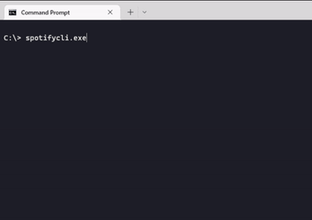

<!-- ABOUT THE PROJECT -->
## SpotifyCLI

CLI application for playing music from your Spotify account. The goal of this project is to have a fast way to listen to Spotify without needing a mouse or the desktop app. 

### Demo


Built with
[![Rust][Rust]][Rust-url]


<!-- GETTING STARTED -->
## Getting Started


### Installation

Coming soon...

### Build

1. Install Rust and Cargo, [ instructions here](https://www.rust-lang.org/tools/install)
2. Clone the repo
   ```
   git clone https://github.com/richcs/spotifycli.git
   ```
3. Run build in project folder
   ```
   cargo build
   ```


<!-- USAGE EXAMPLES -->
## Usage

```
Available Commands:
> play playlist/album         Select and play a playlist/album
> play playlist/album <name>  Play a playlist/album with name <name>
> ls playlist/album           Print list of available playlists/albums
> whoami                      Print your username
> help                        Print list of available commands
> quit                        Exit program 
   ```


<!-- ROADMAP -->
## Roadmap

- [ ] Make application stable enough for release
- [ ] Add more features (shuffle, wider library, etc.)
- [ ] Add unit testing


<!-- CONTRIBUTING -->
## Contributing

If you have a suggestion that would make this better, please fork the repo and create a pull request. You can also simply open an issue with the tag "enhancement". Any contributions you make are **greatly appreciated**.


<!-- LICENSE -->
## License

Distributed under the MIT License. See `LICENSE` for more information.


<!-- CONTACT -->
## Contact

Richard Lei - richardlei.cs@gmail.com


<!-- ACKNOWLEDGMENTS -->
## Acknowledgments

SpotifyCLI was created with the help of these great projects!
* [librespot](https://github.com/librespot-org/librespot)
* [console](https://github.com/console-rs/console)
* [indicatif](https://github.com/console-rs/indicatif)
* [dialoguer](https://github.com/mitsuhiko/dialoguer)

<p align="right">(<a href="#top">back to top</a>)</p>


<!-- MARKDOWN LINKS & IMAGES -->
<!-- https://www.markdownguide.org/basic-syntax/#reference-style-links -->
[Rust]: https://img.shields.io/static/v1?style=for-the-badge&message=Rust&color=000000&logo=Rust&logoColor=FFFFFF&label=
[Rust-url]: https://www.rust-lang.org/